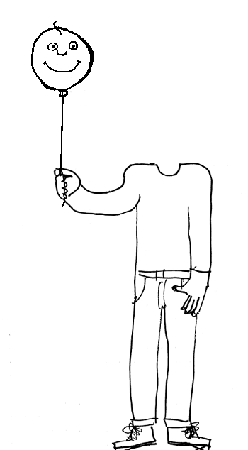
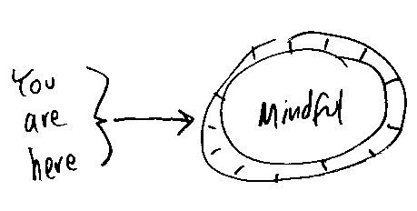
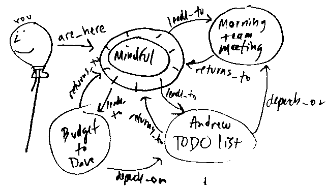

# ADHD Assist

I have ADHD and I need assistance.

As my mind meanders and jumps from idea to idea in a
vast and fanciful world of ideas, I can tell this assistant about
each topical jump. The assistant will maintain a stack of ideas that will
lead me back to where I started.

https://adhd.jonashw.dev

Alternate names:

- Logical Follower
- Rabbit Hole Explorer
- Brainstorm Belay
- Breadcrumb Trail
- Thread Head

Use cases:

- guided exposition of nested ideas (brainstorming)
- todo-lists with dependency-aware prioritization
- conversation aid 
  - Why did I start talking about this particular topic?
  - How can I finish making the point I started to make?

## Background

My head is a balloon, filled with helium and buoyant thoughts. It has a strong tendency to float out of reach and be blown off course by the wind.

My body is the holder of this balloon's string.  Its constant gripping leaves the arm muscles tense and sore.  It could use some assistance keeping the balloon from floating away.

### &quot;You are here.&quot;

Those words are marked next to an unmistakable beacon on the map of your ideas, emotions, and experiences.  All items on the map are linked with navigable relationships.  You announce every change in your mental state to your automated assistant, and it will track your progression through the landscape of your thoughts.  

Sometimes (often?), it's fun to give your mind a bit more slack.  Letting it fly high can be fun.

Why?

Like the physical forces of buoyancy and gravity,  my mind's thoughtful forces are constant.  I enjoy many thoughts throughout my days; so many that I tend to (have to?) forget them after a time. It would be nice to have a record of my thoughts so that I could retrieve the more valuable/viable ones.  A major plus would be to use this tool for note-taking with the goal of providing written communication to coworkers.  I could express ideas in a fashion that suits me, then project the data from that model into standard English for the neurotypicals in my life.